# Hotel Booking agent

## Description
This project was built during my internship for the company Stardekk. Stardekk specializes in cloud software for the hospitality sector.
They wondered if a chatbot could be interesting to deploy for their clients. My bachelor's <a href="https://github.com/DM-be/HotelBooking-agent/raw/master/Bachelorproef_Dennis_Morent.pdf"> thesis </a>
 was built around this interest.

The goal was to build a conversational agent/chatbot that could be contacted on a hotel Facebook page. This agent would guide a client to book a room or to answer questions such as the location of the hotel.

### Technical
The agent is a web server responding to HTTP requests. Within the body of these requests is information about sender, the text sent, channel data,... The Microsoft bot framework v4 leverages this data and provides ways to support a natural flow of a conversation between the sender and the bot.

The design of this application is based on the concept of a stack. Bot framework provides the concept of a "Dialog". This class can be used to manipulate the stack. Dialogs are pushed on top of other dialogs. Some dialogs provide steps in a waterfall like structure. Only when all steps are complete the dialog will end and get pushed off the stack. When this happens an optional result can be returned. Through continuing to a next step in a dialog, ending a dialog, replacing a dialog or starting a new dialog the conversation feels smooth for an end user. This concept also helps in maintaining clear code and structure. In the application everything is a dialog, every separate function is maintained in a separate class. 

I go into full technical detail in my <a href="https://github.com/DM-be/HotelBooking-agent/raw/master/Bachelorproef_Dennis_Morent.pdf"> thesis</a>, supported with code examples and schematics. 

#### Quick replies
Conversations are guided with quick replies. These are text pop-ups users can use to send a text message in a quick and simple way. Manually typing the same text yields the same result. Some interactions are made easier with a quick reply. For example sending your own location or name. The quick replies are also used to provide suggestions on what to do next. 

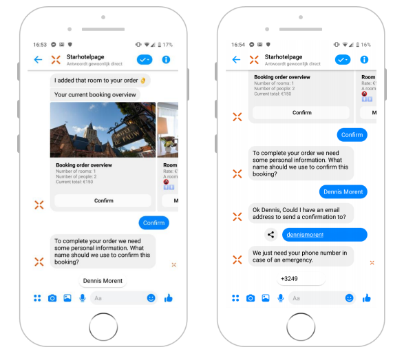

#### LUIS
LUIS is a natural language understanding service provided by Microsoft. It can recognize user intents and entities. 
Sentences are trained to map with intents. Variations of utterances are given a probability, with more data, these intents become more accurate. 
Entities are pretrained by LUIS and provided on a per language basis. English provdes a helpfull "datetimev2" entity, which recognizes words such as "tomorrow" but also utterances such as "next week monday". 

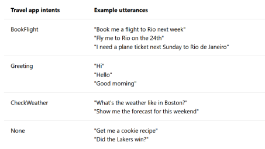

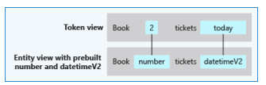

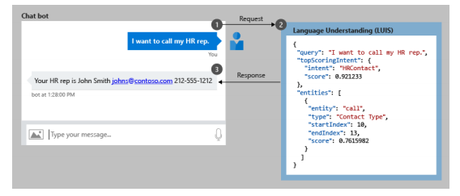

Every response in a dialog is first interpreted by LUIS, according to the recognized intents actions can be taken. For example a user booking a room and realising he/she made a mistake about the checkin date can just say "change my check-in date to next monday" and LUIS would recognize this intent, extract monday as the check-in date and make it available for the bot framework to respond accordingly in code. 

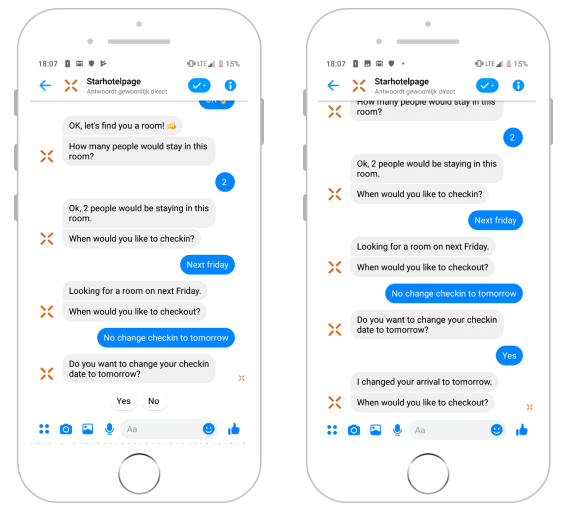

### QnA maker
[QnA Maker](https://qnamaker.ai) is another service provided by Microsoft. It matches questions with answers. A FAQ list is also implemented in the main dialog of this agent.

First a knowledge base is created with example questions (utterances) and an answer. The questions are trained via machine learning and mapped to the answer.

The agent responds with the mapped answer when it recognizes an utterance with a high probability associated with the answer from this knowledge base. More information can be found in my thesis. In the following example the probability is 1, because it is the same exact utterance as trained in the knowledge base.

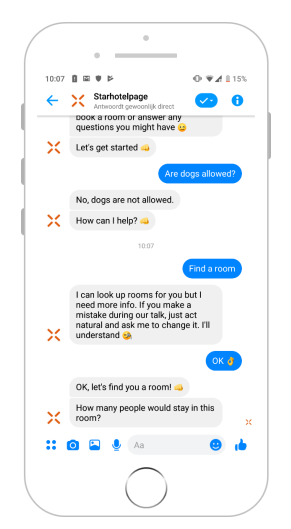 

### Multi language support
The agent supports multiple languages. Whenever a user sends a message to the bot, custom middleware will intercept metadata about the language their Facebook page is in. This in turn will set the threadculture of the agent to this locale. Responses are generated using a .resx file. Separate .resx files can be for each locale.

In this test application only English is used. To fully use multiple languages all LUIS utterances and intents need to be retrained in a different language. As of the moment of building this application the Dutch LUIS integration does not support the "DatetimeV2" entities. Meaning an entity such as "volgende week maandag" would not be recognized. Therefore the choice was made to continue in English for demonstrating purposes although multiple languages are fully supported in the code. 

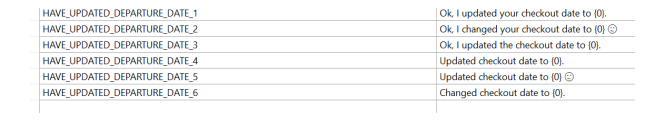

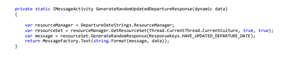

## Features
* full natural language integration through LUIS service
* frequently asked questions integration through the use of QnA maker and service
* find available rooms between check-in and check-out dates
* view rates of a queried room
* book a selected room
* user friendly checkout for payment using Facebook Quick replies (name, number and email)
* receipt after payment with an overview of the purchase
* get directions to the hotel with Google Maps using location quick reply
* multi language support
* random responses 
* switch between dialogs using naturla language
* view pictures of a selected room
* call hotel with easy to use number card action

## screenshots

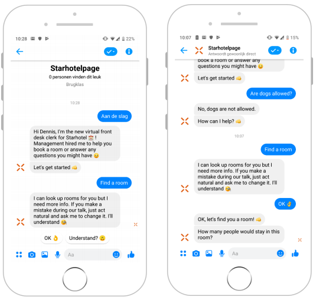
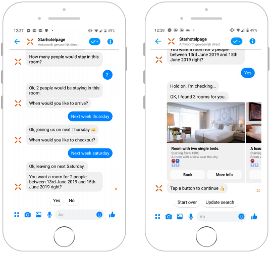
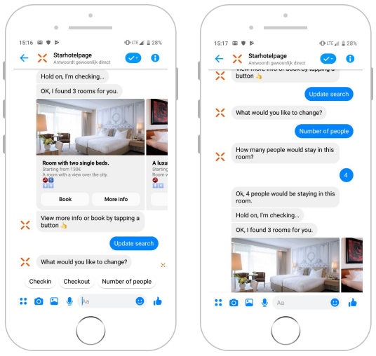
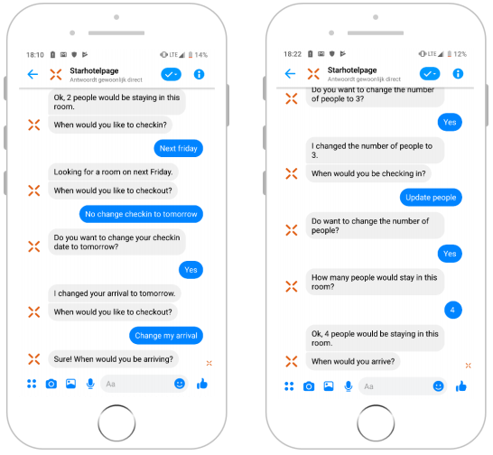
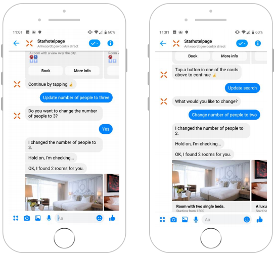
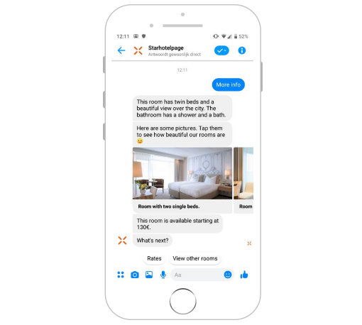
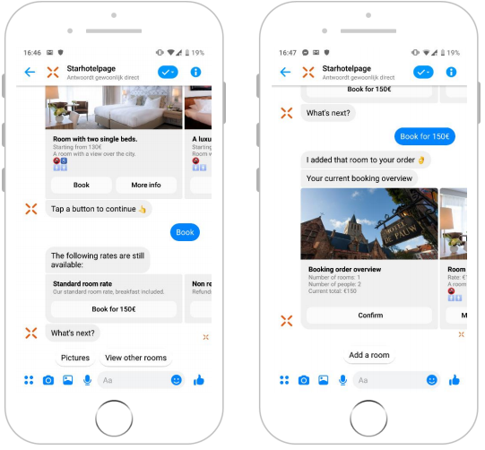
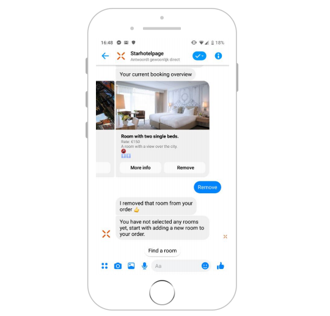
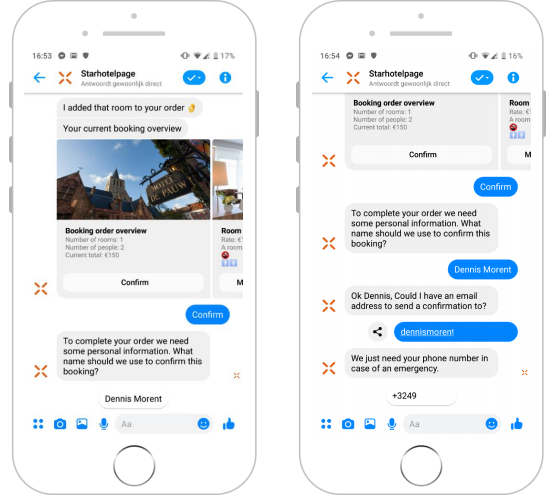
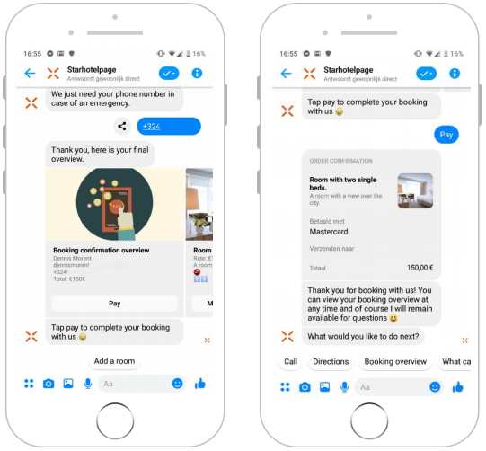
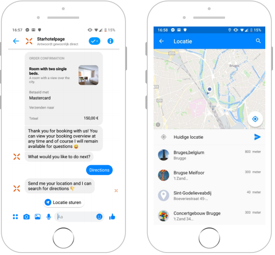
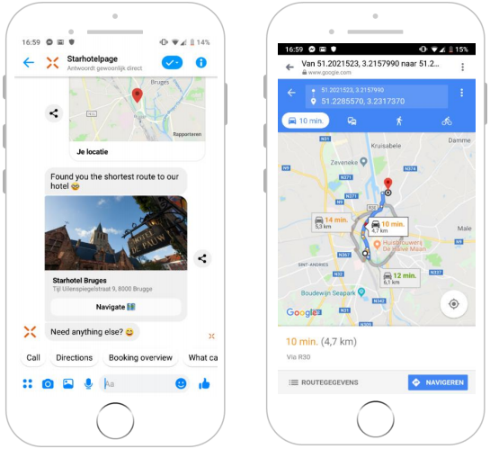

# Further reading
- [Bot Framework Documentation](https://docs.botframework.com)
- [Bot basics](https://docs.microsoft.com/en-us/azure/bot-service/bot-builder-basics?view=azure-bot-service-4.0)
- [Activity processing](https://docs.microsoft.com/en-us/azure/bot-service/bot-builder-concept-activity-processing?view=azure-bot-service-4.0)
- [Prompt Types](https://docs.microsoft.com/en-us/azure/bot-service/bot-builder-prompts?view=azure-bot-service-4.0&tabs=javascript)
- [Azure Bot Service Introduction](https://docs.microsoft.com/en-us/azure/bot-service/bot-service-overview-introduction?view=azure-bot-service-4.0)
- [Channels and Bot Connector Service](https://docs.microsoft.com/en-us/azure/bot-service/bot-concepts?view=azure-bot-service-4.0)

