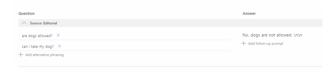

# Hotel Booking agent

## Description
This application was built as a proof of concept during my internship at the company Stardekk. Stardekk specializes in cloud software for the hospitality sector. They provide several products for this sector such as an online booking platform hotels can use to manage their bookings. 

The goal of this project was to build a conversational agent/chatbot that could be contacted on a hotel Facebook page. This agent would guide a client to book a room or answer questions such as the location of the hotel. Findings and technical details are covered in my <a href="https://github.com/DM-be/HotelBooking-agent/raw/master/Bachelorproef_Dennis_Morent.pdf"> thesis</a>.

### Technical
The agent is a web server responding to HTTP requests. Within the body of these requests is information about sender, the text sent, channel data and more. The Microsoft bot framework v4 leverages this data and provides ways to support a natural flow of conversation between sender and bot.

The design of this application is based on the concept of a stack. Bot framework provides the concept of a "Dialog". This construct can be used to manipulate the stack. Dialogs are pushed on top of other dialogs. Some dialogs provide steps in a waterfall like structure. Only when all steps are complete the dialog will end and get pushed off the stack. When a dialog ends an optional result can be returned. Through manipulation of the stack such as progressing to a next step in a dialog, ending a dialog, replacing a dialog or starting a new dialog the conversation feels smooth to the end user. This concept also helps in maintaining clear code and structure. In the application everything is a dialog, every separate functionality is maintained in a separate class. 

I go into full technical detail in my <a href="https://github.com/DM-be/HotelBooking-agent/raw/master/Bachelorproef_Dennis_Morent.pdf"> thesis</a>, supported with code examples and schematics. 

#### Quick replies
Conversations are guided with quick replies. These are text pop-ups users can use to send a text message in a quick and simple way. Manually typing the same text yields the same result. Some interactions are made easier with a quick reply, for example sending your own location or name. The quick replies are also used to provide suggestions on what an end user can do next. 

#### LUIS
LUIS is a natural language understanding service provided by Microsoft. It can recognize user intents and entities. 
Sentences are trained to map with intents. Variations of utterances are given a probability between 0 and 1, depending on the amount of training data available.
Entities are pretrained by LUIS and provided on a per language basis. English provdes a helpfull "datetimev2" entity, which recognizes words such as "tomorrow" but also utterances such as "next week monday". 

Every response in a dialog is first interpreted by LUIS. Depending on the recognized intents follow up actions can be taken. For example a user booking a room and realising he/she made a mistake about the check-in date can simply say "change my check-in date to next monday". LUIS would recognize this "Update checkin date" intent, extract monday as the check-in date and make it available for the bot framework to respond appropiately. In this case it will ask for confirmation before adjusting the value. 

### QnA maker
[QnA Maker](https://qnamaker.ai) is another service provided by Microsoft. It maps multiple questions to a single answer. 
This functionality is implemented in the main dialog of this agent. It can be extended to several sub dialogs. 

A knowledge base needs to be created with example questions (utterances) and an answer. The questions are trained with machine learning and mapped to the answer. This happens in a similar way as LUIS but less transparent for the developer. 

The agent responds with the mapped answer when it recognizes a question from the knowledge base.

 

### Multi language support
The agent supports multiple languages. Whenever a user sends a message to the bot custom middleware will intercept metadata about the language they use in Facebook. This data about the locale is used to set the threadculture agent. Responses are generated using a .resx file. Separate .resx files can be for each language.

In this test application only English is used. To make full use of multiple languages all LUIS utterances and intents need to be retrained in a new language. As of the moment of building this application the Dutch LUIS integration does not support the "datetimev2" entity. Meaning an entity such as "volgende week maandag" would not be recognized. Therefore the choice was made to continue in English for demonstrating purposes although multiple languages are fully supported internally.

## Features
* full natural language integration through LUIS service
* frequently asked questions integration through the use of QnA maker and service
* find available rooms between check-in and check-out dates
* view rates of a queried room
* book a selected room
* user friendly checkout for payment using Facebook Quick replies (name, number and email)
* receipt after payment with an overview of the purchase
* get directions to the hotel with Google Maps using location quick reply
* multi language support
* random responses 
* switch between dialogs using naturla language
* view pictures of a selected room

## Screenshots

# Further reading
- [Bot Framework Documentation](https://docs.botframework.com)
- [Bot basics](https://docs.microsoft.com/en-us/azure/bot-service/bot-builder-basics?view=azure-bot-service-4.0)
- [Activity processing](https://docs.microsoft.com/en-us/azure/bot-service/bot-builder-concept-activity-processing?view=azure-bot-service-4.0)
- [Prompt Types](https://docs.microsoft.com/en-us/azure/bot-service/bot-builder-prompts?view=azure-bot-service-4.0&tabs=javascript)
- [Azure Bot Service Introduction](https://docs.microsoft.com/en-us/azure/bot-service/bot-service-overview-introduction?view=azure-bot-service-4.0)
- [Channels and Bot Connector Service](https://docs.microsoft.com/en-us/azure/bot-service/bot-concepts?view=azure-bot-service-4.0)

